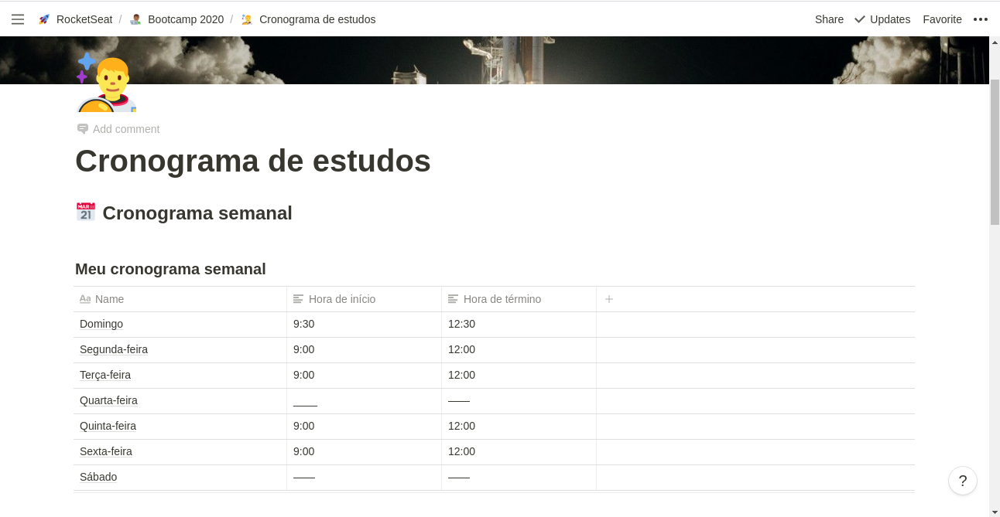
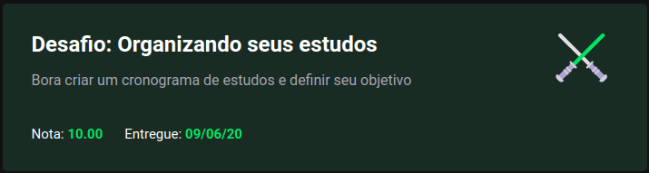

<h3 align="center">
  Challenge 1: Planning my studies
</h3>

<blockquote align="center">“Your only limitation is yourself”!</blockquote>

  <a href="#about-challenge">About the challenge</a>&nbsp;&nbsp;&nbsp;|&nbsp;&nbsp;&nbsp;
  <a href="#preview">Preview</a>&nbsp;&nbsp;&nbsp;|&nbsp;&nbsp;&nbsp;
  <a href="#evaluation">Evaluation</a>&nbsp;&nbsp;&nbsp;|&nbsp;&nbsp;&nbsp;
  <a href="#license">License</a>

<h2 id="about-challenge">📑️ About the challenge</h2>

In this challenge, you must plan your studies.

For that, you must create a cronogram that will be adapted according to your time and rhythm.

Define what'll be your study schedule, creating tasks that will be attached to a calendar, to help you study and always be aligned with your goals!

<h2 id="preview">📽️ Preview</h2>

<h2 id="evaluation">⭐️ Evaluation</h2>

The implementation of the challenge received top marks!

<h2 id="license">📜️ License</h2>

  

    This project is under license from MIT. See the <a href="../LICENSE">LICENSE</a> file for more details.
  

  

    <a href="#cover">Back to top ⬆️</a>
  

---

Developed with 💙️ by Misael Augusto
