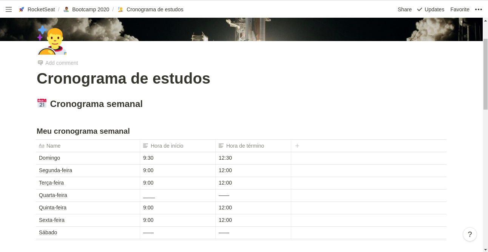

<h3 align="center">
  Desafio 1: Planejando meus estudos
</h3>

<blockquote align="center">“Sua única limitação é você mesmo”!</blockquote>

  <a href="#about-challenge">Sobre o desafio</a>&nbsp;&nbsp;&nbsp;|&nbsp;&nbsp;&nbsp;
  <a href="#preview">Demonstração</a>&nbsp;&nbsp;&nbsp;|&nbsp;&nbsp;&nbsp;
  <a href="#evaluation">Avaliação</a>&nbsp;&nbsp;&nbsp;|&nbsp;&nbsp;&nbsp;
  <a href="#license">Licença</a>

<h2 id="about-challenge">📑️ Sobre o desafio</h2>

Nesse desafio, você deve planejar os seus estudos.

Para isso, você deve criar um cronograma que irá se adaptar ao seu tempo e ritmo.

Defina qual será seu horário de estudo, criando tarefas que estarão atreladas a um calendário, para se manter com foco e sempre alinhado com seus objetivos!

<h2 id="preview">📽️ Demonstração</h2>

<h2 id="evaluation">⭐️ Avaliação</h2>

A implementação do desafio recebeu nota máxima!

<h2 id="license">📜️ Licença</h2>

  

    Esse projeto está sob a licença MIT. Veja o arquivo <a href="../LICENSE">LICENSE</a> para mais detalhes.
  

  

    <a href="#cover">Voltar ao topo ⬆️</a>
  

---

Desenvolvido com 💙️ por Misael Augusto
