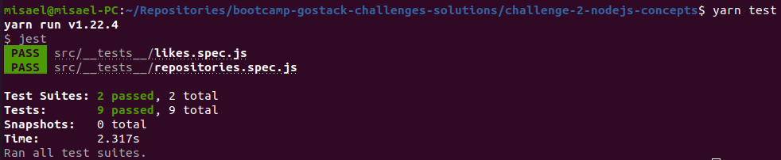
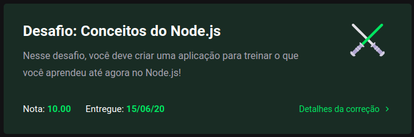

<h3 align="center">
  Challenge 2: Nodejs Concepts
</h3>

<blockquote align="center">“Don't wait to plant, only have patience to harvest”!</blockquote>

  <a href="#about-challenge">About the challenge</a>&nbsp;&nbsp;&nbsp;|&nbsp;&nbsp;&nbsp;
  <a href="#preview">Preview</a>&nbsp;&nbsp;&nbsp;|&nbsp;&nbsp;&nbsp;
  <a href="#evaluation">Evaluation</a>&nbsp;&nbsp;&nbsp;|&nbsp;&nbsp;&nbsp;
  <a href="#license">License</a>

<h2 id="about-challenge">📑️ About the challenge</h2>

In this challenge, you must create a application to practice what you have learned in Node.js!

Thils will be an application to storage repositories of your portfolio, that will allow you to list, update, and delete repositories, and besides that, the repositories can also receive likes.

<h2 id="preview">📽️ Preview</h2>

<h2 id="evaluation">⭐️ Evaluation</h2>

The implementation of the challenge received top marks!

<h2 id="license">📜️ License</h2>

  

    This project is under license from MIT. See the <a href="../LICENSE">LICENSE</a> file for more details.
  

  

    <a href="#cover">Back to top ⬆️</a>
  

---

Developed with 💙️ by Misael Augusto
