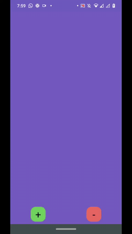
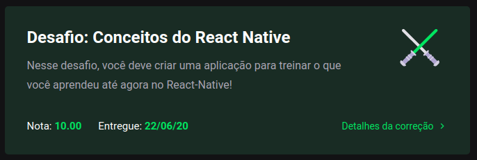

<h3 align="center">
  Challenge 4: React Native Concepts
</h3>

<blockquote align="center">“Success is not the result of a game, but the destination of a journey”!</blockquote>

  <a href="#about-challenge">About the challenge</a>&nbsp;&nbsp;&nbsp;|&nbsp;&nbsp;&nbsp;
  <a href="#preview">Preview</a>&nbsp;&nbsp;&nbsp;|&nbsp;&nbsp;&nbsp;
  <a href="#evaluation">Evaluation</a>&nbsp;&nbsp;&nbsp;|&nbsp;&nbsp;&nbsp;
  <a href="#license">License</a>

<h2 id="about-challenge">📑️ About the challenge</h2>

In this challenge, you must create an application to train what you have learned so far in React Native!

Now you must continue to develop the application that will store your portfolio repositories, which you have already developed the backend using Node.js, and in the last challenge in ReactJS.

<h2 id="preview">📽️ Preview</h2>

<h2 id="evaluation">⭐️ Evaluation</h2>

The implementation of the challenge received top marks!

<h2 id="license">📜️ License</h2>

  

    This project is under license from MIT. See the <a href="../LICENSE">LICENSE</a> file for more details.
  

  

    <a href="#cover">Back to top ⬆️</a>
  

---

Developed with 💙️ by Misael Augusto
