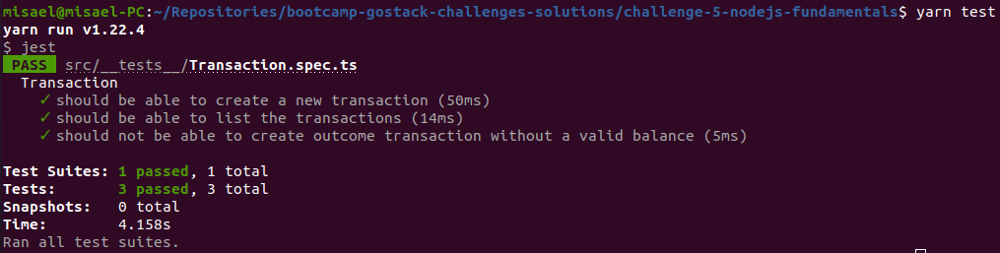
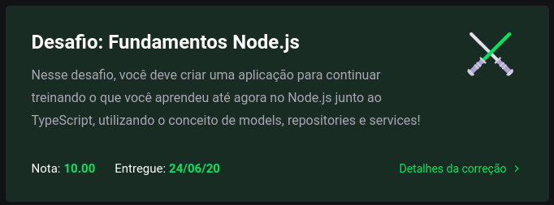

<h3 align="center">
  Challenge 5: Nodejs Fundamentals
</h3>

<blockquote align="center">“For those who get better every day, getting ready is utopia”!</blockquote>

  <a href="#about-challenge">About the challenge</a>&nbsp;&nbsp;&nbsp;|&nbsp;&nbsp;&nbsp;
  <a href="#preview">Preview</a>&nbsp;&nbsp;&nbsp;|&nbsp;&nbsp;&nbsp;
  <a href="#evaluation">Evaluation</a>&nbsp;&nbsp;&nbsp;|&nbsp;&nbsp;&nbsp;
  <a href="#license">License</a>

<h2 id="about-challenge">📑️ About the challenge</h2>

In this challenge, you must create an application to continue training what you have learned so far in Node.js with TypeScript, using the concept of models, repositories and services!

This will be an application to store incoming and outgoing financial transactions, which should allow the registration and listing of these transactions.

<h2 id="preview">📽️ Preview</h2>

<h2 id="evaluation">⭐️ Evaluation</h2>

The implementation of the challenge received top marks!

<h2 id="license">📜️ License</h2>

  

    This project is under license from MIT. See the <a href="../LICENSE">LICENSE</a> file for more details.
  

  

    <a href="#cover">Back to top ⬆️</a>
  

---

Developed with 💙️ by Misael Augusto

