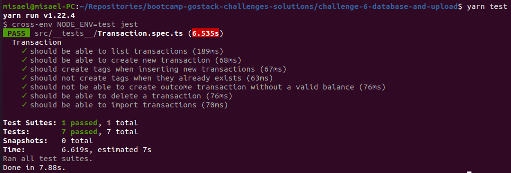

<h3 align="center">
  Challenge 6: Database and file upload with Nodejs
</h3>

<blockquote align="center">“Just wish for the things you're willing to fight for”!</blockquote>

  <a href="#about-challenge">About the challenge</a>&nbsp;&nbsp;&nbsp;|&nbsp;&nbsp;&nbsp;
  <a href="#preview">Preview</a>&nbsp;&nbsp;&nbsp;|&nbsp;&nbsp;&nbsp;
  <a href="#evaluation">Evaluation</a>&nbsp;&nbsp;&nbsp;|&nbsp;&nbsp;&nbsp;
  <a href="#license">License</a>

<h2 id="about-challenge">📑️ About the challenge</h2>

In this challenge, you must continue to develop the transaction management application, training what you have learned so far in Node.js together with TypeScript, but this time including using a database with TypeORM and sending files with Multer!

This will be an application that should store incoming and outgoing financial transactions and allow the registration and listing of these transactions, in addition to allowing the creation of new records in the database by sending a csv file.

<h2 id="preview">📽️ Preview</h2>

<h2 id="evaluation">⭐️ Evaluation</h2>

The implementation of the challenge received top marks!

<h2 id="license">📜️ License</h2>

  

    This project is under license from MIT. See the <a href="../LICENSE">LICENSE</a> file for more details.
  

  

    <a href="#cover">Back to top ⬆️</a>
  

---

Developed with 💙️ by Misael Augusto

