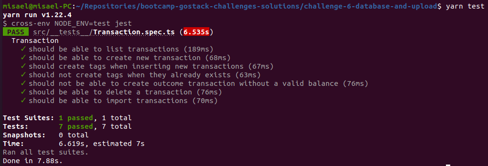
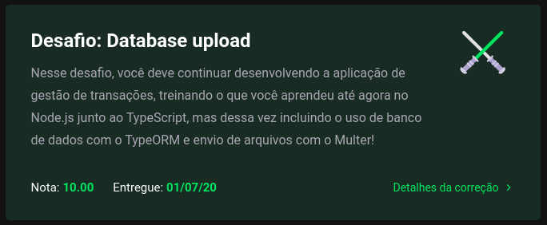

<h3 align="center">
  Desafio 6: Banco de dados e upload de arquivos no Node.js
</h3>

<blockquote align="center">“Só deseje as coisas as quais você está disposto a lutar”!</blockquote>

  <a href="#about-challenge">Sobre o desafio</a>&nbsp;&nbsp;&nbsp;|&nbsp;&nbsp;&nbsp;
  <a href="#preview">Demonstração</a>&nbsp;&nbsp;&nbsp;|&nbsp;&nbsp;&nbsp;
  <a href="#evaluation">Avaliação</a>&nbsp;&nbsp;&nbsp;|&nbsp;&nbsp;&nbsp;
  <a href="#license">Licença</a>

<h2 id="about-challenge">📑️ Sobre o desafio</h2>

Nesse desafio, você deve continuar desenvolvendo a aplicação de gestão de transações, treinando o que você aprendeu até agora no Node.js junto ao TypeScript, mas dessa vez incluindo o uso de banco de dados com o TypeORM e envio de arquivos com o Multer!

Essa será uma aplicação que deve armazenar transações financeiras de entrada e saída e permitir o cadastro e a listagem dessas transações, além de permitir a criação de novos registros no banco de dados a partir do envio de um arquivo csv.

<h2 id="preview">📽️ Demonstração</h2>

<h2 id="evaluation">⭐️ Avaliação</h2>

A implementação do desafio recebeu nota máxima!

<h2 id="license">📜️ Licença</h2>

  

    Esse projeto está sob a licença MIT. Veja o arquivo <a href="../LICENSE">LICENSE</a> para mais detalhes.
  

  

    <a href="#cover">Voltar ao topo ⬆️</a>
  

---

Desenvolvido com 💙️ por Misael Augusto

