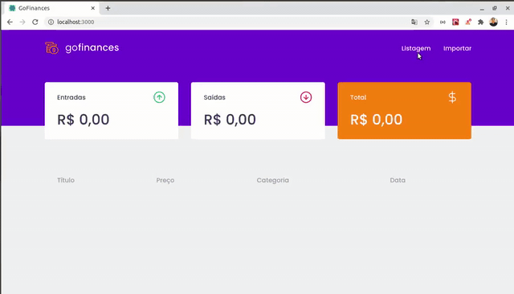
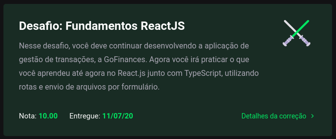

<h3 align="center">
  Challenge 7: ReactJS Fundamentals
</h3>

<blockquote align="center">“Don't expect brilliant results if your goals are unclear”!</blockquote>

  <a href="#about-challenge">About the challenge</a>&nbsp;&nbsp;&nbsp;|&nbsp;&nbsp;&nbsp;
  <a href="#preview">Preview</a>&nbsp;&nbsp;&nbsp;|&nbsp;&nbsp;&nbsp;
  <a href="#evaluation">Evaluation</a>&nbsp;&nbsp;&nbsp;|&nbsp;&nbsp;&nbsp;
  <a href="#license">License</a>

<h2 id="about-challenge">📑️ About the challenge</h2>

In this challenge, you must continue to develop the transaction management application, GoFinances. Now you will practice what you have learned so far in React.js along with TypeScript, using routes and sending files by form.

This will be an application that will connect to your Challenge 06 backend, and display the created transactions and allow the import of a CSV file to generate new records in the database.

<h2 id="preview">📽️ Preview</h2>

<h2 id="evaluation">⭐️ Evaluation</h2>

The implementation of the challenge received top marks!

<h2 id="license">📜️ License</h2>

  

    This project is under license from MIT. See the <a href="../LICENSE">LICENSE</a> file for more details.
  

  

    <a href="#cover">Back to top ⬆️</a>
  

---

Developed with 💙️ by Misael Augusto

