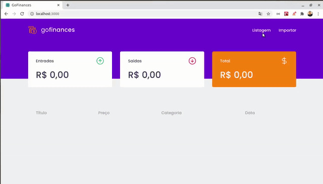
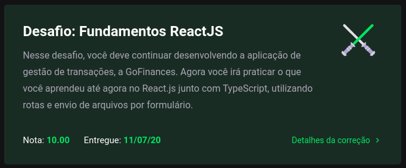

<h3 align="center">
  Desafio 7: Fundamentos do ReactJS
</h3>

<blockquote align="center">“Não espere resultados brilhantes se suas metas não forem claras”!</blockquote>

  <a href="#about-challenge">Sobre o desafio</a>&nbsp;&nbsp;&nbsp;|&nbsp;&nbsp;&nbsp;
  <a href="#preview">Demonstração</a>&nbsp;&nbsp;&nbsp;|&nbsp;&nbsp;&nbsp;
  <a href="#evaluation">Avaliação</a>&nbsp;&nbsp;&nbsp;|&nbsp;&nbsp;&nbsp;
  <a href="#license">Licença</a>

<h2 id="about-challenge">📑️ Sobre o desafio</h2>

Nesse desafio, você deve continuar desenvolvendo a aplicação de gestão de transações, a GoFinances. Agora você irá praticar o que você aprendeu até agora no React.js junto com TypeScript, utilizando rotas e envio de arquivos por formulário.

Essa será uma aplicação que irá se conectar ao seu backend do Desafio 06, e exibir as transações criadas e permitir a importação de um arquivo CSV para gerar novos registros no banco de dados.

<h2 id="preview">📽️ Demonstração</h2>

<h2 id="evaluation">⭐️ Avaliação</h2>

A implementação do desafio recebeu nota máxima!

<h2 id="license">📜️ Licença</h2>

  

    Esse projeto está sob a licença MIT. Veja o arquivo <a href="../LICENSE">LICENSE</a> para mais detalhes.
  

  

    <a href="#cover">Voltar ao topo ⬆️</a>
  

---

Desenvolvido com 💙️ por Misael Augusto

